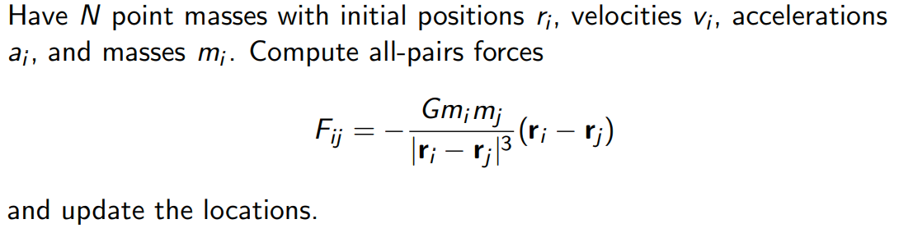
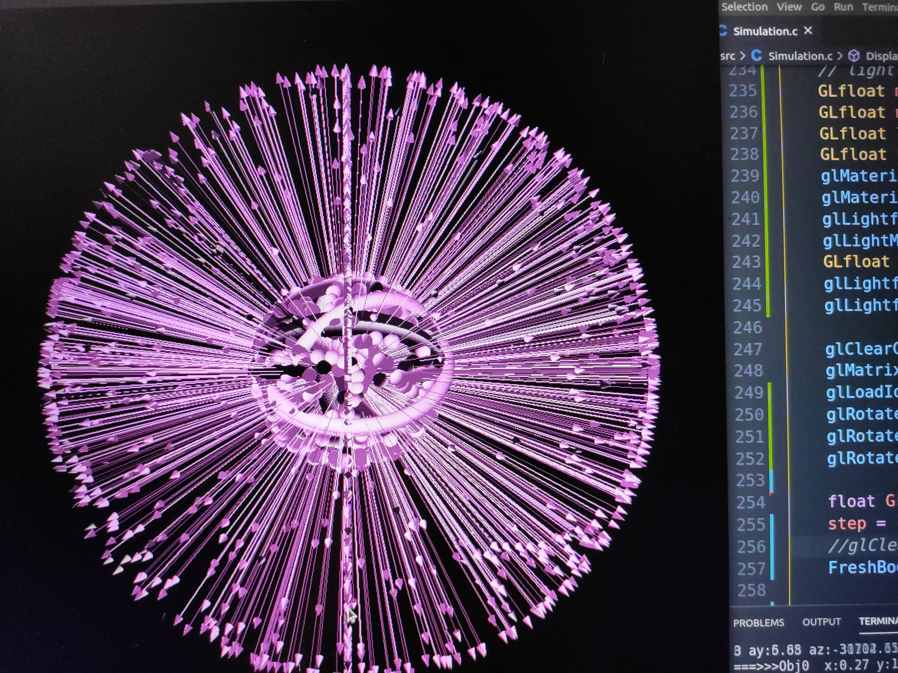
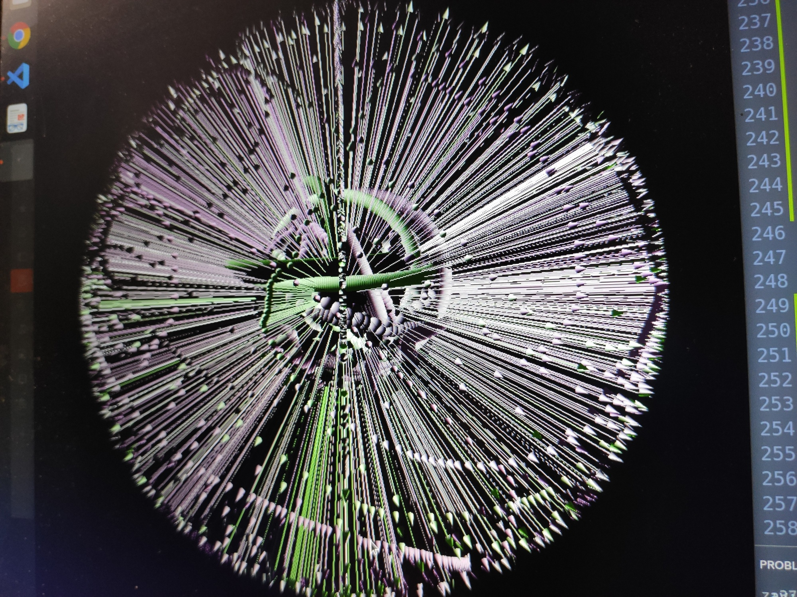

# N-Body Gravity Simulation 

## Intro
- This project originated from the problem below-----</br>



</br>

## Components
- [x] **Physics Engine**
- [x] **Visualization**
- [ ] **Unit testing**
- [x] **Interactive** user interactivity with simulation(keyboard, mouse, etc)

</br>

## Directory

```
.
├── include
│   ├── body.h
│   └── Config.h
├── src
│   ├── Config.c
│   └── Simulation.c
├── inital_state.in
├── README.MD
├── run.sh
└── setting.cfg
```

</br>

## Do Something Cool
- [x] Advanced OpenGL 
- [x] Threading
- [ ] Parallelize with OpenMP
- [ ] More interactive

</br>

## Do Something interesting
- Comment Line256 in ./src/Simulation.c , make, and run the binary file. Then freely move mouse, and you will get things below :)</br>

</br>


